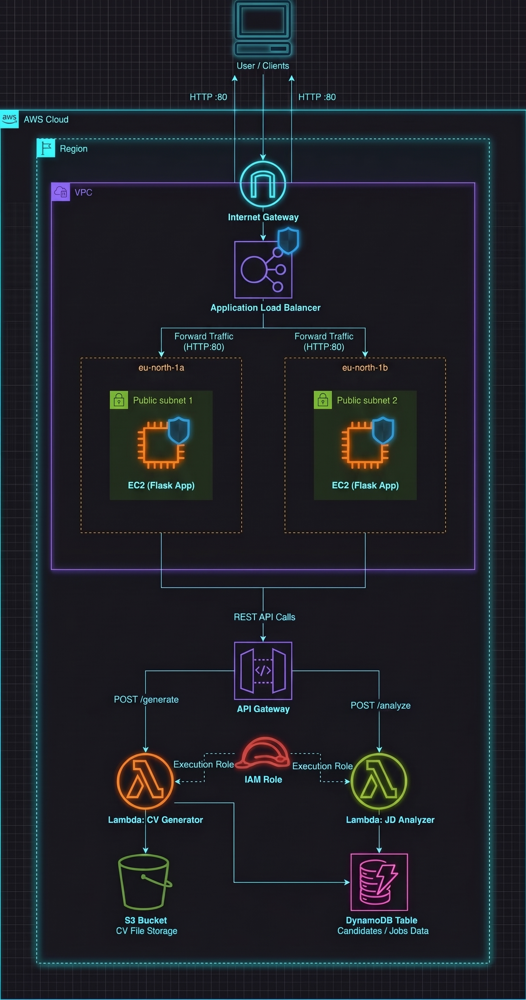

#  ATS CVs Generator & Analyzer — Serverless AWS Project

> A fully serverless, cloud-native application that generates ATS-optimized CVs and analyzes their compatibility with job descriptions — built entirely on AWS Free Tier.

---

## Project Overview
This project is a real-world AWS implementation that demonstrates how multiple cloud services work together to build a production-grade application. Users fill out a form with their professional details, receive a downloadable ATS-friendly CV, and can instantly compare it against any job description to get a match score and improvement suggestions.

**The project covers:**
- Networking (VPC, Subnets, Security Groups, Internet Gateway, Route Tables)
- Compute (EC2, Lambda)
- Load Balancing (Application Load Balancer)
- Storage (S3)
- Database (DynamoDB)
- API Management (API Gateway)
- Security (IAM Roles & Policies)

---

## 🏗️ Architecture

### AWS Services Used

| Service | Role |
|---|---|
| **VPC** | Isolated private network for all resources |
| **Subnets (x2)** | Public subnets across 2 Availability Zones |
| **Internet Gateway** | Enables internet access for the VPC |
| **Route Table** | Routes traffic from subnets to the internet |
| **Security Groups** | Firewall rules — EC2 only accepts traffic from ALB |
| **EC2 (x2 t2.micro)** | Hosts the Flask web application |
| **Application Load Balancer** | Distributes traffic across both EC2 instances |
| **S3** | Stores generated CV text files |
| **DynamoDB** | Stores CV data for the analyzer Lambda |
| **Lambda (x2)** | Serverless functions for CV generation and JD analysis |
| **API Gateway** | HTTP interface that connects Flask to Lambda |
| **IAM Role** | Grants Lambda permissions for S3 and DynamoDB |

## Features

- **CV Generation** — Fills out a form → generates an ATS-optimized plain-text CV → stores it in S3 → returns a download link
- **JD Analysis** — Paste any job description → get a match score (0–100%) → see missing keywords → get improvement suggestions
- **High Availability** — Two EC2 instances in two Availability Zones behind a Load Balancer
- **Serverless Backend** — Lambda functions scale automatically with zero server management
- **100% Free Tier** — Runs within AWS Free Tier limits for personal/learning use
